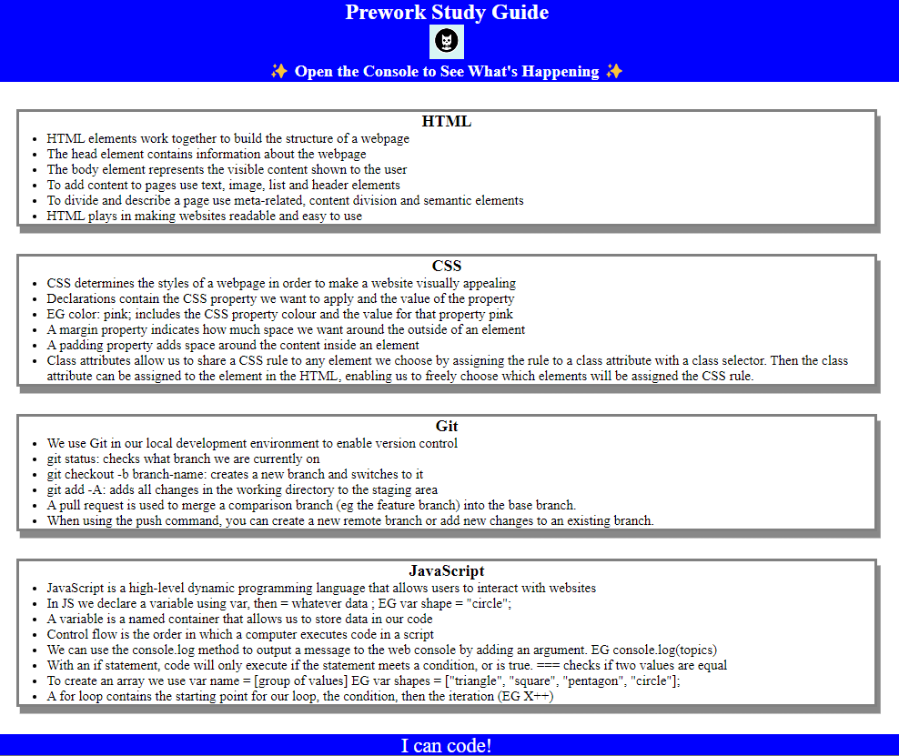
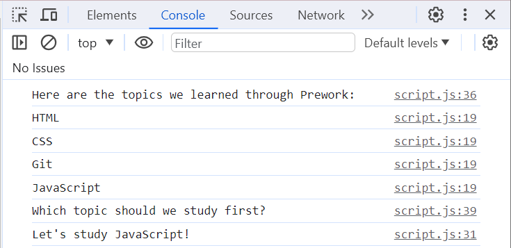

# Prework Study Guide

## Description
This Prework Study Guide project was created for students enrolled in the 16 Week Front End Web Development Bootcamp. The webpage provides students with notes from the Prework Module, and allows them to easily find and read the information. 

Notes are avaialble on the following four Topics: HTML, CSS, Git and JavaScript. 

## Installation
N/A

## Usage
To use the Prework Study Guide, you can read the notes under each topic. Notes are availble for HTML, CSS, Git and Javascript. 

Not sure which topic to study first? Open the console to get recommendations!

To access the ChromeDevTools console on Mac0S press command+option+I. 
To access the ChromeDevTools console on Windows press control+shift+I or alternatively you can right click and select "inspect". Then click on the Console Tab (you will find this between Elements and Sources tabs). 

The console should open up beside or below the webpage in your browser. You will be able to see the list of all topics from the Prework Module alongside a recommendation on which one to study first. If you've opened the console correctly it will look like the image below, the only difference may be which topic is being reccommended to you. 

## Credits
N/A

## License
MIT
